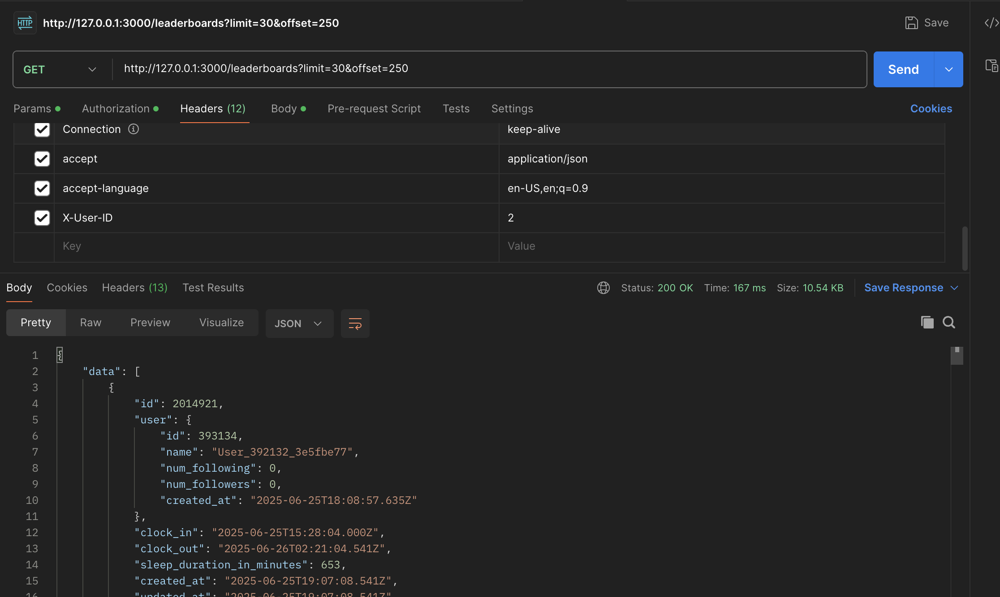

## Performance Test

### Get User following that has 300K followings
```
sleepsocial(dev)> User.find(2).following.count
  User Load (6.2ms)  SELECT `users`.* FROM `users` WHERE `users`.`id` = 2 LIMIT 1 /*application='Sleepsocial'*/
  User Count (7477.8ms)  SELECT COUNT(*) FROM `users` INNER JOIN `follows` ON `users`.`id` = `follows`.`target_user_id` WHERE `follows`.`user_id` = 2 /*application='Sleepsocial'*/
=> 372055
sleepsocial(dev)>
```


### (cold start) Get Leaderboard from users that has 300K followings
```
sleepsocial(dev)> uf =UserFeed.new(User.find(2))
  User Load (39.5ms)  SELECT `users`.* FROM `users` WHERE `users`.`id` = 2 LIMIT 1 /*application='Sleepsocial'*/
=>
#<UserFeed:0x000000012dd9f980
...
sleepsocial(dev)> uf.count
=> 16087 # 16k
```

