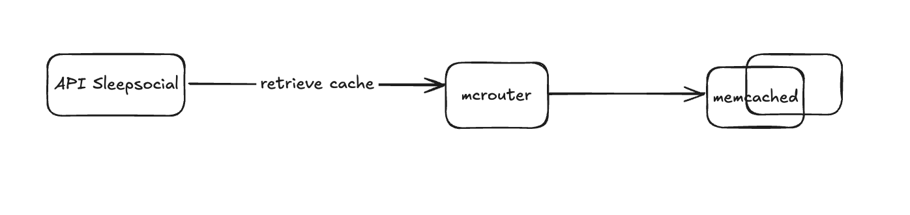

## Sleep Logs Sharing System Design Documentation
This document provides an overview of the system design for the Sleep Logs Sharing application, explaining its components and how they interact to provide a seamless experience for users.

### 1. Introduction
The Sleep Logs Sharing system is designed to allow users to log their sleep, share it, and view sleep-related data such as feeds and leaderboards.

### 2. System Architecture Overview
The system comprises several key components that work together to handle user requests, process data, and store information. Here's a high-level look at the interactions:

**User:** Interacts directly with the application's API.

**API (Sleepsocial):** The central entry point for all user requests. It handles incoming sleep logs, data retrieval, and acts as a gateway to other services.

**Kafka:** A distributed streaming platform used for asynchronously processing sleep log events.

**Job Consumers:** Services that pull data from Kafka and perform background processing tasks, such as updating leaderboards or other aggregated data.

**Memcached**: A high-performance distributed memory caching system used for caching frequently accessed data.

**Redis:** An in-memory data structure store used for building real-time feeds and leaderboards, leveraging its speed for fast data access.

**MySQL:** A relational database management system used for durable storage of all sleep log data and other persistent information.

### 3. Component Breakdown and Interactions
Let's delve into each component and understand its role in the system:

#### 3.1. User
The user initiates all interactions with the system, typically through a client application (e.g., mobile app, web browser). When a user logs their sleep or requests to view data, their request is sent to the API.

#### 3.2. API (Sleepsocial)
The Sleepsocial API is the backbone of the application. It performs the following key functions:

Receives User Requests: All incoming requests from users (e.g., logging sleep, fetching feeds, checking leaderboards) first hit this API.

Data Ingestion: When a user logs sleep, the API sends this event to Kafka for asynchronous processing, ensuring that the primary request can be handled quickly without waiting for all downstream operations to complete.

Data Retrieval: For requests like fetching models, the API queries Memcached for cached data. If the data is not in the cache, it falls back to MySQL.

Feed/Leaderboard Generation: The API also interacts with Redis to build and retrieve real-time feeds and leaderboards.

Durable Data Storage: The API is responsible for storing critical, durable data directly into MySQL.

#### 3.3. Kafka
Kafka acts as a highly scalable and fault-tolerant message broker. Its primary role in this system is:

Asynchronous Processing: Sleep log events are published to Kafka by the API. This decouples the API from the actual processing of these events, allowing the API to respond quickly to users.

Event Queue: It provides a reliable queue for job consumers to pull sleep log data for further processing.

#### 3.4. Job Consumers
These are independent services that continuously monitor and pull data from Kafka. Their responsibilities include:

Processing Sleep Logs: They consume sleep log events from Kafka.

Updating Aggregated Data: Based on the consumed sleep logs, job consumers update various aggregated data structures in Redis (for feeds and leaderboards).

#### 3.5. Memcached
Memcached is used as a distributed caching layer to improve the performance of data retrieval.

Identity Cache: It stores frequently accessed models data. When the API needs model information, it first checks Memcached.

Reduced Database Load: By serving data from cache, it reduces the load on MySQL, making the system more responsive.

#### 3.6. Redis
Redis is utilized for its high-speed data structures, making it ideal for our leaderboards data.

Feeds and Leaderboards: It is specifically used for building and serving user feeds and global/friends leaderboards. Its in-memory nature allows for very fast read/write operations crucial for these dynamic features.

Job Consumer Interaction: Job consumers write processed sleep data to Redis to update these feeds and leaderboards. Consumer also discard expired logs lazily during read.

#### 3.7. MySQL
MySQL serves as the primary relational database for durable data storage.

Durable Data Storage: All persistent and critical sleep log data, user profiles, and other relational information are stored here.

Source of Truth: It acts as the ultimate source of truth for all data in the system.

Backup for Cache: If data is not found in Memcached, the API will query MySQL to retrieve it.

### 4. Data Flow Examples
Let's illustrate the data flow with a couple of common scenarios:

#### 4.1. Logging a Sleep Entry
User logs sleep: The user interacts with the client application, which sends a request to the Sleepsocial API.

API sends to Kafka: The Sleepsocial API receives the sleep log, immediately stores essential durable data in MySQL, and then publishes the sleep log event to a Kafka topic. It responds to the user, indicating successful logging.

Job Consumer picks up: A Job Consumer service pulls the new sleep log event from Kafka.

Job Consumer updates Redis: The Job Consumer processes the sleep log and updates the relevant user's feed and any affected leaderboards in Redis. It might also update related cached data in Memcached if necessary.

#### 4.2. Fetching a User's Feed
User requests feed: The user interacts with the client application, requesting to see their sleep feed. This request goes to the Sleepsocial API.

API fetches from Redis: The Sleepsocial API directly queries Redis to retrieve the user's personalized sleep feed, which is pre-built and optimized for fast retrieval.

API returns feed: The API sends the retrieved feed data back to the user.

### 5. Benefits of this Design
Scalability: The use of Kafka for asynchronous processing and Redis for real-time data allows the system to handle a high volume of concurrent users and data.

Durability: MySQL ensures that all sleep log data is durably stored.

Performance: Memcached provides fast access to frequently requested data, while Redis offers high-speed operations for feeds and leaderboards.

Decoupling: Kafka decouples the API from background processing tasks, improving the API's responsiveness and overall system resilience.

Real-time Capabilities: Redis enables the creation of real-time feeds and leaderboards, providing an engaging user experience.

This design ensures a robust, scalable, and performant system for sharing and managing sleep logs.

### 6. Reliability & Scalability

#### User Feed / Leaderboards

Since we precomputed the leaderboards in Redis, We can retrieve leaderboard very fast. We build the dashboard using **sorted sets**, so our data sorted by score, or sleep duration.
The drawback from using redis is we might missing data if the redis restart. To tackle this problem, we can setup Redis Cluster / KeyDB with primary and replica setup. This setup will increase our reliability by partitioning the data, increase scalability, and fail-over mechanism if the primary fails.

#### Caching Models

The memcached is only used to store models cache. We don't need it to be more durable by using primary-replica setup. However to increase our availability and scalability, we can utilize mcrouter and memcached cluster, so we can partition the data using consistent hashing.

#### Aysnc Job

We use Kafka to make our feeds creation fan out executor to be scalable. By increasing number of partition, We could achieve more parallelism to gain more throughput. If that is not sufficient, we need another framework to increase our throughput such as [ugroup](https://www.uber.com/en-ID/blog/introducing-ugroup-ubers-consumer-management-framework/) that manage parallelism in application layer.

The main challenge using aync job is we have to make sure the **ordering** correct for some cases.

For example: Follow -> Unfollow -> Follow

We need to use user-feed's user id as partition key, so that we can ensure any feed events for that user, is ordered correctly. Thus we wouldn't see a user's sleep log that has been unfollowed recently.